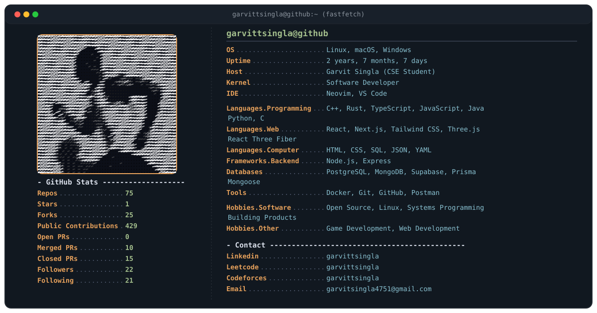

<div align="center">
  
</div>

<br />

<details>
<summary>⚡ How this profile works</summary>

<br />

```text
               GitHub API
                   │
                   ▼
profile.json ──> generate.py <── assets/ascii.txt
                   │
                   ▼
           assets/profile.svg
                   │
                   ▼
                README.md
```

### Automation & Customization
- **Personal Information**: Edit `profile.json` to update role, education, tech stack, hobbies, or social links.
- **ASCII Art**: Replace or customize `assets/ascii.txt` (or convert an image using `python image_to_ascii.py image.png`).
- **GitHub Workflow**: `.github/workflows/update-profile.yml` runs automatically every 6 hours or on push to fetch updated statistics and regenerate `assets/profile.svg`.

### Local Execution
```bash
python -m venv .venv
source .venv/bin/activate  # On Windows: .venv\Scripts\activate
pip install -r requirements.txt
python generate.py
```

</details>